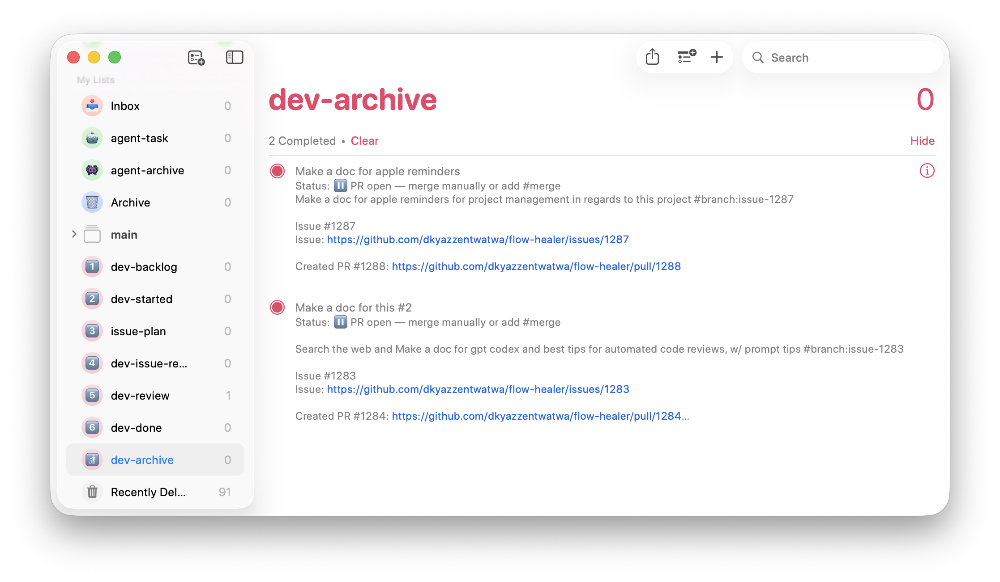
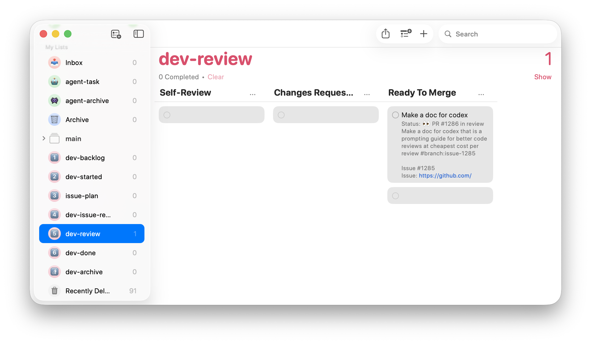

# apple-git 🍎

[](https://opensource.org/licenses/MIT)
[](https://www.python.org/downloads/)
[]()

**apple-git** turns Apple Reminders into a GitHub operating layer.

Instead of living in GitHub tabs all day, you can capture work, move tasks through planning, dispatch AI coding agents, and review finished branches from a simple Reminders board. GitHub stays the system of record for issues, branches, and pull requests, but your day-to-day workflow can happen in a faster, lower-friction interface.

If you want a lightweight alternative to manually interacting with GitHub for every issue lifecycle step, this is the point of the project.



## Why Use It

- **Stay in Reminders:** Use a native macOS board instead of juggling GitHub issues, PR pages, and project views.
- **Plan before codegen:** `issue-plan` creates the issue and posts a structured implementation plan before any worker starts.
- **Dispatch background agents:** `dev-issue-ready` starts a Codex, Claude, or Kilo worker on a dedicated issue branch.
- **Review only when work is ready:** Successful runs move into `dev-review`, where you can test and approve the branch like a normal engineering workflow.
- **Keep GitHub in sync:** Issues, plan comments, PRs, merges, and mapping state are still tracked against the real repository.

## Workflow At A Glance

1. Add work to `dev-backlog`.
2. Move a reminder to `issue-plan` to create the GitHub issue and generate the implementation plan.
3. Move it to `dev-issue-ready` to start the coding agent on `issue-{number}`.
4. Let `apple-git` move the finished reminder to `dev-review` when the worker completes.
5. Review and test the branch locally.
6. Move the reminder to `dev-done` when you want the PR merged and the issue closed.



## ✨ Features

- **Reminders-first issue flow:** Run a software workflow from Apple Reminders instead of driving everything from GitHub UI.
- **Structured planning gate:** Create issues and attach a canonical implementation plan before code generation starts.
- **CLI agent workers:** Start background Claude, Codex, or Kilo runs on issue branches from a reminder move.
- **PR handoff:** Use `dev-review` as the manual verification stage before merge.
- **Optional AI reviews:** Add issue analysis, PR review, and security review when Anthropic is configured.
- **Persistent mapping:** SQLite tracks reminder-to-issue, reminder-to-PR, and connector run state.
- **Reminders feedback loop:** Status text and body annotations keep the board readable without opening GitHub for every check.

## 🚀 Getting Started

### Prerequisites

- **macOS:** Required for AppleScript automation of the Reminders app.
- **Python 3.11+**
- **GitHub Account & Token:** A classic Personal Access Token (PAT) with `repo` scope.
- **AI CLI Tool:** Ensure your preferred worker CLI (`codex`, `claude`, or `kilo`) is installed and in your PATH.
- **Anthropic API Key:** Optional, only for issue analysis and PR/security review add-ons.

### Installation

1.  **Clone the repository:**
    ```bash
    git clone https://github.com/dkyazzentwatwa/apple-git.git
    cd apple-git
    ```

2.  **Install dependencies:**
    ```bash
    pip install -e ".[dev]"
    ```

### Configuration

1.  **Environment Setup:**
    Copy the example environment file and configure your credentials.
    ```bash
    cp .env.example .env
    ```
    Edit `.env` with your details:
    ```ini
    GITHUB_TOKEN=your_github_pat
    APPLE_GIT_GITHUB_REPO=owner/repo_name
    APPLE_GIT_CONNECTOR_BACKEND=codex
    APPLE_GIT_CONNECTOR_MODEL=gpt-5.4-mini
    APPLE_GIT_CONNECTOR_COMMAND=codex
    APPLE_GIT_ANTHROPIC_API_KEY=your_anthropic_key  # optional
    ```

2.  **Reminders App Setup:**
    Create the necessary lists in Apple Reminders (e.g., `dev-backlog`, `issue-plan`, `dev-issue-ready`, `dev-review`, `dev-done`).
    *See [docs/REMINDERS_SETUP.md](docs/REMINDERS_SETUP.md) for a detailed walkthrough of the workflow and list setup.*

3.  **Application Config (Optional):**
    Customize list names and polling intervals in `config/config.yaml`.

## 🖥️ Usage

### Running the Daemon

Start the synchronization loop:

```bash
apple-git
# or
python -m apple_git
```

The tool will begin polling your Reminders lists. Check the console output or `~/.apple-git/apple-git.log` for activity.

### The Workflow

1.  **Backlog:** Capture a task in `dev-backlog`.
2.  **Plan:** Move it to `issue-plan`.
    - `apple-git` creates the GitHub issue.
    - Posts a structured implementation plan comment.
    - If you want a revised plan, add `#regen-plan` plus optional feedback text while it stays in `issue-plan`.
3.  **Activate:** Move it to `dev-issue-ready`.
    - `apple-git` starts the configured coding agent on an issue branch such as `issue-123`.
4.  **Review:** When the worker finishes, `apple-git` moves the reminder to `dev-review`.
    - This is your manual test and approval stage.
    - Moving it through review creates or links the PR.
5.  **Complete:** Move it to `dev-done`.
    - Merges the PR when `#merge` is present.
    - Closes the GitHub issue.
    - Marks the reminder as completed.

## 🏗️ Architecture

- **Orchestrator (`src/apple_git/`):** Central Python application that watches reminder lists and advances workflow state.
- **Planner and workers:** Planning and code generation run through CLI backends such as `codex`, `claude`, and `kilo`.
- **Storage:** SQLite (`~/.apple-git/apple_git.sqlite`) tracks mappings and connector runs.
- **Logs:** Activity is written to stdout, file logs, connector run logs, and optionally Apple Notes.

## 🛠️ Development

### Testing
Run the test suite:
```bash
pytest
```

### Linting
Check for code style issues:
```bash
ruff check .
```

### Clean Up
Utility script to delete all issue branches from the repo:
```bash
python cleanup_branches.py
```

## 📄 License

This project is licensed under the MIT License - see the [LICENSE](LICENSE) file for details.
